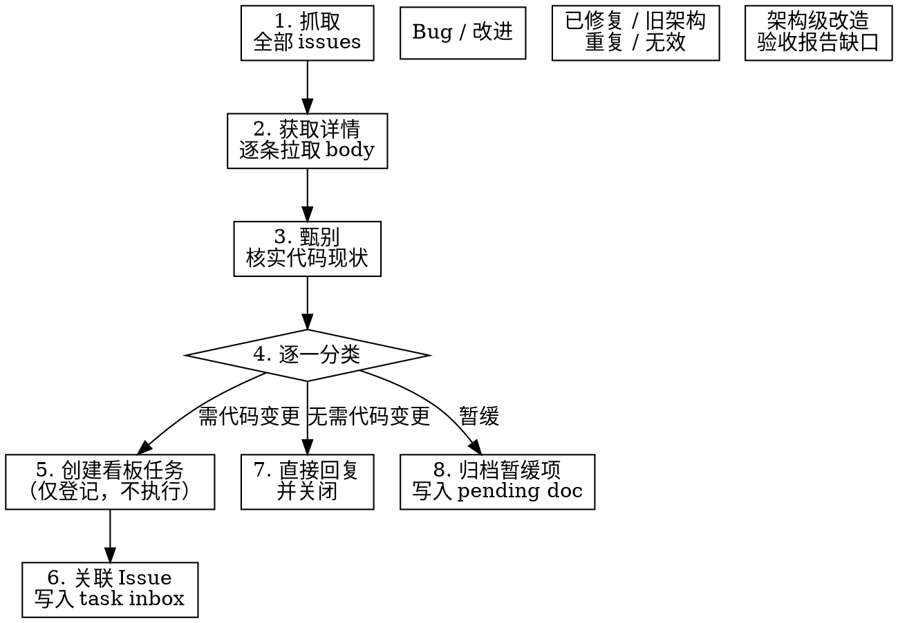

# GitHub Issue 处理流程

## 概述

将 GitHub Issues 转化为看板任务或直接回复关闭。**本 skill 只负责信息处理和任务登记，不执行任何代码变更。** 代码修复由后续 Agent 通过 `/kanban run TASK-NNN` 走完整 Plan → Execute → Evaluate → Retrospective → User Decision 流程完成。

## 使用场景

- `/loop` 定时巡检 kanban-framework issues
- 手动「检查 issue 仓库并处理」的指令
- 任何从 GitHub issue URL 开始的甄别分类任务

## 核心原则

**本 skill 不写代码。** 它的职责边界是：

- 抓取 issue → 阅读代码核实 → 分类
- 需要修的：创建看板任务 + 写入 inbox（登记制）
- 不需要修的：直接回复 + 关闭
- 代码修复走完整 kanban FSM，由后续 Agent 执行

## 流程图



## 各步骤详情

### 1. 抓取

```bash
gh issue list -R kongshan001/kanban-framework --state open --limit 50 \
  --json number,title,labels,createdAt
```

获取全部 open issues，此阶段不做筛选。

### 2. 获取详情

**对全部 issue 逐一拉取 body 内容**，不做预先过滤：

```bash
for n in $(echo '<issue_numbers>'); do
  gh issue view $n -R kongshan001/kanban-framework --json body,title
done
```

**原则**：基于标题模式跳过 issue 是错误的。必须阅读每个 issue 的实际内容后再判断。验收报告可能包含有价值的测试发现和改进建议；无标签 issue 可能描述真实 bug。判断权在分析之后，不在过滤阶段。

### 3. 甄别（对照当前架构）

项目已从 bash 迁移至 Python。对每个 issue：

- 找到 `.claude/skills/kanban/core/` 中对应的源文件
- 阅读代码确认 Bug 是否仍然存在
- 涉及 `guard.sh`、bash 解析、`jq` 的 issue 属于旧架构遗留 —— 回复说明后关闭

### 4. 逐一分类

对每个 issue 阅读 body 后逐一判断，**不允许批量跳过**：

| 类别 | 判断依据 | 处理方式 |
|------|----------|----------|
| **确认的 Bug** | 阅读代码后 bug 仍存在 | 创建看板任务，写入 inbox（不执行） |
| **改进需求** | 有价值的功能增强 | 创建看板任务，写入 inbox（不执行） |
| **已修复** | 代码已包含对应修复 | 回复说明修复情况，关闭 |
| **旧架构遗留** | 涉及 guard.sh、bash 解析、jq | 回复说明已迁移 Python，关闭 |
| **架构级改造** | 改动量大，需设计讨论 | 记录到 pending doc，**不关闭** |
| **验收/验证报告** | 标题含「验收报告」「验证报告」 | 逐一回复各发现项状态，记录缺失项到 inbox，**不关闭**（缺口补齐后再关） |
| **重复/无效** | 内容为空、完全重复 | 回复说明，关闭 |

验收报告不可跳过 —— 它们包含手动测试结果和具体改进建议，每一项发现都应有回复。

### 5. 创建看板任务（仅登记，不执行）

按 IR-13：将所有相关修复合并为**一个**看板任务。

```bash
PYTHONPATH=.claude/skills/kanban python -m core.cli.main create "标题" --desc "描述"
```

- **禁止在当前会话中执行 `/kanban run`** —— 任务登记后停留在 `plan` 阶段
- **禁止直接编码、测试、提交** —— 代码变更必须走完整 kanban FSM（IR-12）
- 框架自身修复建议使用 `--auto-mode all` 创建，减少后续 Agent 的交互确认
- 任务将由后续 Agent（如定时调度 Agent）通过 `/kanban run TASK-NNN` 执行

### 6. 关联 Issue 到 Task Inbox

将每个相关 issue 的信息写入任务目录的 `inbox.md`，供后续执行 Agent 获取上下文：

```markdown
## Issue #NNN — <title>
- URL: https://github.com/kongshan001/kanban-framework/issues/NNN
- 分类: Bug / 改进
- 涉及文件: <paths>
- 修复要点: <从 issue body 提取的关键信息>
```

写入路径：`.kanban/tasks/TASK-NNN/inbox.md`

### 7. 回复非 Bug Issue

对**已修复 / 旧架构遗留 / 重复 / 无效**类别的 issue，直接回复说明并关闭：

```bash
gh issue comment <N> -R kongshan001/kanban-framework --body "..."
gh issue close <N> -R kongshan001/kanban-framework -r "completed" -c "说明"
```

回复内容应包含：
- 已修复的：说明在哪个 commit 已修复
- 旧架构的：说明已迁移至 Python，此 issue 不再适用

### 8. 归档暂缓项

**架构级改造** issue → 写入 `.kanban/inbox/pending-architecture-issues.md`：

- Issue 编号和链接
- 问题摘要
- 暂缓原因（改动量大 / 需设计讨论）
- 建议方向

**验收报告**中的缺口项 → 写入对应任务的 inbox，issue 保持 open 追踪。

## 禁止事项

以下行为**严格禁止**，违反即违反 kanban 铁律：

| 禁止行为 | 违反规则 | 正确做法 |
|----------|----------|----------|
| 创建任务后直接在主分支编码 | IR-12 | 登记任务，由后续 Agent 走 FSM |
| 跳过 Plan → Execute → Evaluate 流程 | IR-12 | 完整 FSM 不可绕过 |
| 手动提交代码不走看板 | IR-12 | 所有变更必须有 TASK-NNN 记录 |
| 在当前会话执行 `/kanban run` | 本 skill 职责边界 | 仅登记，不执行 |
| 跳过 issue body 详情的读取 | 甄别质量 | 必须逐一拉取 body |
| 基于标题模式跳过 issue | 甄别质量 | 判断在分析后，不在过滤阶段 |
| 关闭架构级 issue | 追踪完整性 | 记录 pending doc，保持 open |
| 跳过验收报告 | 遗漏有价值发现 | 逐一回复，缺口记录 inbox |

## 定时任务集成

`/loop 30m` 定时任务应严格按本 skill 执行。任务 prompt：

```
按照 github-issue-processing skill 的完整流程，从
https://github.com/kongshan001/kanban-framework/issues
抓取 open issues，逐一甄别分类。

需要代码修复的 → 创建看板任务 + 写入 inbox（不执行）
不需要代码修复的 → 直接回复并关闭
架构级/验收报告 → 归档 pending doc

禁止编码、测试、提交。禁止 /kanban run。
```
