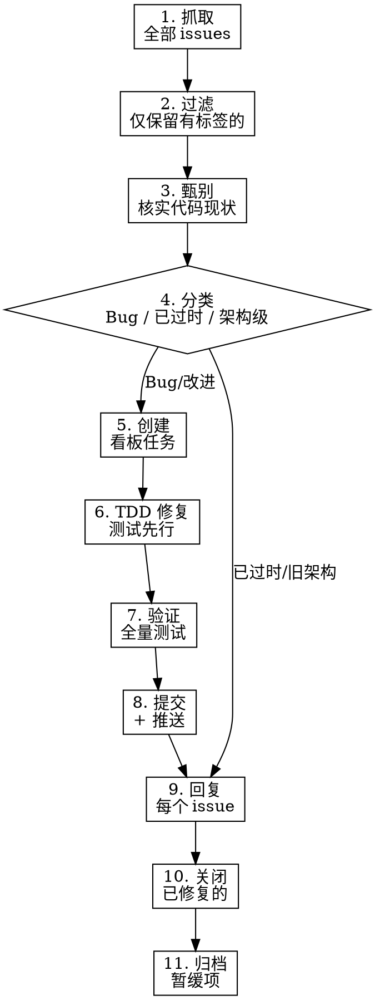

# GitHub Issue 处理流程

## 概述

将 GitHub Issues 转化为看板任务、修复已确认 Bug、回复并关闭的标准流程。**每一步都是强制性的**，跳过任何步骤都会导致遗漏或未通知。

## 使用场景

- `/loop` 定时巡检 kanban-framework issues
- 手动「检查 issue 仓库并修复」的指令
- 任何从 GitHub issue URL 开始的修复任务

## 流程图



## 各步骤详情

### 1. 抓取

```bash
gh issue list -R kongshan001/kanban-framework --state open --limit 50 \
  --json number,title,labels,createdAt
```

获取全部 open issues，此阶段不做筛选。

### 2. 过滤

区分有效信息与噪音：

- **保留**：带 `bug` 或 `enhancement` 标签的 issue
- **跳过**：验证报告（标题含「验证报告」）、无标题的不完整 issue
- **人工判断**：无标签但标题明确的，查看 body 后再决定

### 3. 甄别（对照当前架构）

项目已从 bash 迁移至 Python。对每个 issue：

- 找到 `.claude/skills/kanban/core/` 中对应的源文件
- 阅读代码确认 Bug 是否仍然存在
- 涉及 `guard.sh`、bash 解析、`jq` 的 issue 属于旧架构遗留在 —— 回复说明后关闭

### 4. 分类

| 类别 | 处理方式 |
|------|----------|
| **确认的 Bug** | 进入看板任务流程 |
| **已修复** | 回复说明修复情况，关闭 |
| **旧架构遗留** | 回复说明已迁移 Python，关闭 |
| **架构级改造** | 记录到 inbox 待讨论，**不关闭** |

### 5. 创建看板任务（合并同类项）

按 IR-13：将所有相关修复合并为**一个**看板任务。

```bash
PYTHONPATH=.claude/skills/kanban python -m core.cli.main create "标题" --desc "描述"
```

框架自身修复可使用轻量模式（不走 worktree）。

### 6. TDD 修复

**强制使用** superpowers:test-driven-development。

- 先写失败测试
- 确认失败原因正确
- 写最小修复代码
- 确认测试通过

### 7. 全量验证

```bash
cd .claude/skills/kanban && PYTHONPATH=. python -m pytest test/ -q
```

必须 100% 绿色通过。任何失败 → 修复后再继续。

### 8. 提交并推送

按 IR-14：commit 后立即 push。

```bash
git add <具体文件>
git commit -m "fix: TASK-NNN — <摘要>"
git push
```

### 9. 回复 Issue

对**每一个**涉及到的 issue 回复：

- 修复了什么 / 发现了什么
- 关联的 commit
- 对旧架构的 issue：说明为何不适用

```bash
gh issue comment <N> -R kongshan001/kanban-framework --body "..."
```

### 10. 关闭已修复的 Issue

```bash
gh issue close <N> -R kongshan001/kanban-framework -r "completed" -c "修复说明"
```

**注意**：架构级/暂缓的 issue 不关闭 —— 只关闭确认已修复的。

### 11. 归档暂缓项

改动量大的架构级 issue → 写入 `.kanban/inbox/pending-architecture-issues.md`，包含：

- Issue 编号和链接
- 问题摘要
- 暂缓原因
- 建议方向（供后续讨论）

## 常见错误

| 错误 | 纠正 |
|------|------|
| 不检查代码就直接修 | 强制执行第3步甄别 |
| 每个 issue 单独建任务 | IR-13：合并为一个 |
| 关闭架构级 issue | 它们不是「已修复」，应归档文档 |
| 先关闭再回复 | 先回复，再关闭 |
| 跳过全量测试 | 第7步必须在第8步之前 |

## 定时任务集成

`/loop 30m` 定时任务应严格按本 skill 执行。任务 prompt：

```
按照 github-issue-processing skill 的完整11步流程，从
https://github.com/kongshan001/kanban-framework/issues
中提取有价值的问题并处理。注意甄别Python架构 vs 旧bash架构。
```
